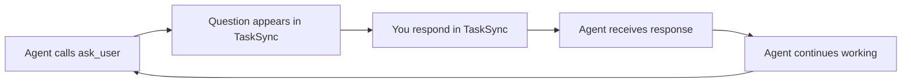

Get TaskSync running and interact with your first AI agent in under 5 minutes.

## What You'll Learn

By the end of this quickstart, you'll:
- Install the TaskSync VS Code extension
- Enable the `ask_user` tool for AI agents
- Send your first task to an AI agent
- Experience the human-in-the-loop workflow

<Note>
This guide focuses on **Option 1: VS Code Extension** (recommended). For terminal protocol or MCP server options, see [Installation](/installation).
</Note>

## Prerequisites

- VS Code version 1.90.0 or higher
- GitHub Copilot or another VS Code AI extension that supports language model tools

## Step 1: Install TaskSync Extension

<Steps>
  <Step title="Open VS Code Extensions">
    Click the Extensions icon in the Activity Bar (or press `Ctrl+Shift+X` / `Cmd+Shift+X`)
  </Step>
  
  <Step title="Search for TaskSync">
    Search for **"TaskSync"** by publisher **4regab**
  </Step>
  
  <Step title="Install the Extension">
    Click **Install** on the TaskSync extension
  </Step>
  
  <Step title="Open TaskSync Panel">
    After installation, click the TaskSync icon in the Activity Bar to open the sidebar
  </Step>
</Steps>

## Step 2: Configure AI Agent Settings

For the best experience with GitHub Copilot, add this setting to allow longer agent sessions:

```json
{
  "chat.agent.maxRequests": 999
}
```

<Warning>
Enable **"Auto Approve"** in VS Code settings for uninterrupted agent operation. Without this, you'll need to manually approve each tool call.
</Warning>

## Step 3: Your First Interaction

Now let's test the human-in-the-loop workflow:

<Steps>
  <Step title="Open GitHub Copilot Chat">
    Open Copilot Chat in VS Code (or your preferred AI assistant)
  </Step>
  
  <Step title="Instruct the Agent to Use ask_user">
    Send this prompt to your AI agent:
    
    ```
    @workspace Please use the ask_user tool to ask me what task I want you to help with.
    ```
  </Step>
  
  <Step title="Agent Calls ask_user Tool">
    The AI agent will invoke the `ask_user` tool. You'll see a notification in the TaskSync sidebar with the agent's question.
  </Step>
  
  <Step title="Respond in TaskSync Panel">
    Type your response in the TaskSync input field and press Enter (or use the configured send shortcut).
    
    Try: **"Create a Python script that prints Hello World"**
  </Step>
  
  <Step title="Agent Receives Your Response">
    The agent gets your response and begins working on the task. It will call `ask_user` again when it needs feedback or has completed the work.
  </Step>
</Steps>

## Understanding the Workflow

TaskSync creates a **feedback loop** between you and AI agents:



This cycle continues until:
- You explicitly tell the agent to stop
- The agent completes all tasks
- You start a new session

## Key Features to Try Next

<CardGroup cols={2}>
  <Card title="Queue Mode" icon="list">
    Queue multiple prompts to be automatically sent when the agent calls `ask_user`
  </Card>
  
  <Card title="Autopilot" icon="plane">
    Let agents work autonomously with automatic responses using cycling prompts
  </Card>
  
  <Card title="File References" icon="file">
    Type `#` to attach files or folders as context in your responses
  </Card>
  
  <Card title="History" icon="clock-rotate-left">
    View all past `ask_user` interactions via the history button in the title bar
  </Card>
</CardGroup>

## Recommended Agent Instructions

For optimal results, add these instructions to your AI agent's context (or create a custom chat mode):

```markdown
### TaskSync Tool Instructions

1. Use the ask_user tool to request feedback or clarification when:
   - Explicit user approval is required before proceeding
   - You need clarification on requirements
   - A task phase is complete and you're ready for the next instruction
   - You encounter an ambiguity or decision point

2. Always call ask_user before ending a conversation or task

3. If the user provides feedback, adjust your behavior accordingly and 
   continue calling ask_user as needed

4. Only stop calling ask_user when the user explicitly indicates "end", 
   "stop", or "no more interaction needed"
```

<Note>
For the full protocol specification used by the **Terminal Protocol** option, see the [tasksync-v5.2.md](https://github.com/4regab/TaskSync/blob/main/Prompt/tasksync-v5.2.md) prompt file.
</Note>

## Common Issues

<AccordionGroup>
  <Accordion title="Agent doesn't call ask_user tool">
    Make sure:
    - The TaskSync extension is installed and activated
    - Your AI assistant supports VS Code language model tools
    - You've explicitly instructed the agent to use the `ask_user` tool
    - Auto Approve is enabled in VS Code settings (if using Copilot)
  </Accordion>
  
  <Accordion title="No notification sound">
    Check `tasksync.notificationSound` setting:
    ```json
    {
      "tasksync.notificationSound": true
    }
    ```
  </Accordion>
  
  <Accordion title="Send shortcut not working">
    By default, Enter sends messages. If you prefer Ctrl+Enter (Cmd+Enter on macOS):
    ```json
    {
      "tasksync.sendWithCtrlEnter": true
    }
    ```
  </Accordion>
</AccordionGroup>

## Next Steps

<CardGroup cols={2}>
  <Card title="Installation Options" icon="download" href="/installation">
    Explore all three installation methods including terminal protocol and MCP server
  </Card>
  
  <Card title="Core Features" icon="star" href="/features/queue-mode">
    Learn about Queue Mode, Autopilot, and session management
  </Card>
  
  <Card title="Configuration" icon="gear" href="/guides/configuration">
    Customize timeout settings, human-like delays, and autopilot behavior
  </Card>
  
  <Card title="File References" icon="hashtag" href="/features/file-references">
    Master file references, context providers, and reusable prompts
  </Card>
</CardGroup>
